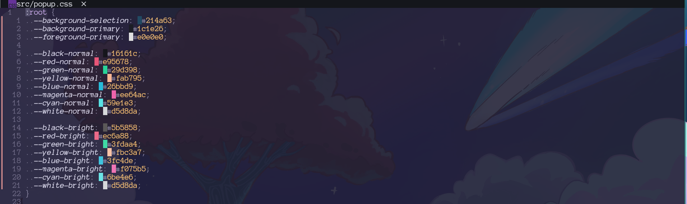

# 🎨 csscolor.nvim

A fast, lightweight Neovim plugin that provides real-time color previews directly in your CSS files. It uses Tree-sitter and Neovim's built-in extmarks to display a colored block right in front of your hex codes and color values.

## ✨ Features
* **Real-time Previews:** Instantly see the colors you are coding.
* **Tree-sitter Powered:** Fast, accurate parsing without the overhead of heavy regex engines.
* **Native Extmarks:** Uses non-disruptive virtual text that doesn't mess up your code formatting or alignment.

## 🚀 Usage

You can easily enable or disable the color highlights on the fly using the provided user command:

```vim
:CssColorToggle
```



